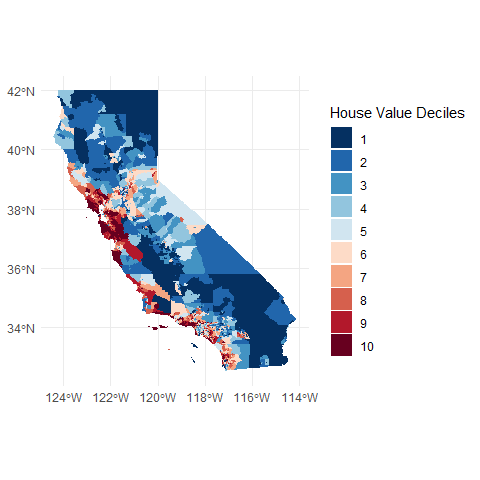
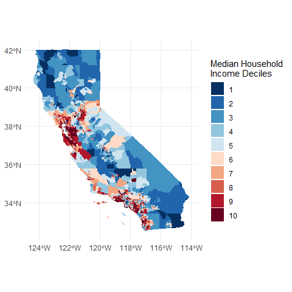
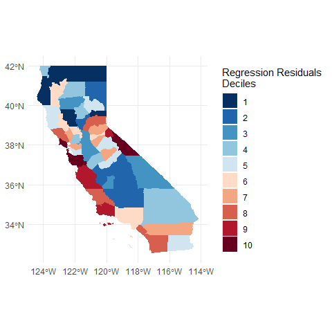
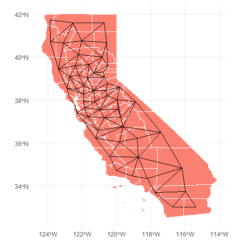
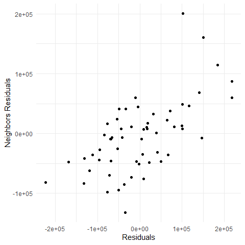
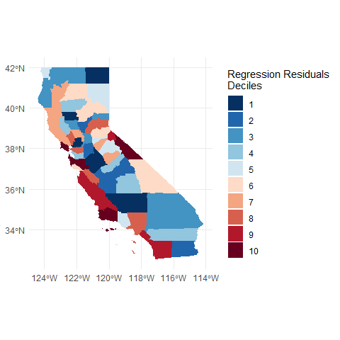
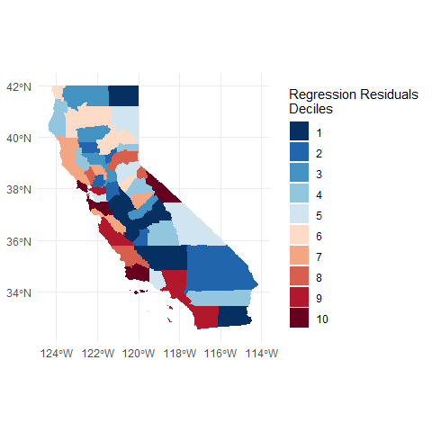

Tutorial inspired by
<https://rspatial.org/raster/analysis/7-spregression.html>.

## Introduction

This chapter deals with the problem of inference in (regression) models
with spatial data. Inference from regression models with spatial data
can be suspect. In essence this is because nearby things are similar,
and it may be problematic to assume that observations from nearby units
are independent (as we do in standard regression). Therefore, such
models need to be diagnosed before reporting them. Specifically, it is
important to evaluate the presence of spatial autocorrelation in the
residuals (as these are assumed to be independent, not correlated). If
the residuals are spatially autocorrelated, this indicates that the
model is misspecified, the OLS assumptions are violated and the
coefficients are biased. In that case you should try to improve the
model by adding (and perhaps removing) important variables. If that is
not possible (either because there is no data available, or because you
have no clue as to what variable to look for), you can try formulating a
regression model that controls for spatial autocorrelation. We show some
examples of that approach here.

## Reading & aggregating data

We use California house price data from the 2000 Census.

We read the data from the `rspatial` library.

``` r
housesCTData <- sp_data('houses2000')
```

These are the variables we have:

| Variable Name | Explanation                                                        |
|:--------------|:-------------------------------------------------------------------|
| nhousingUn    | Number of housing units                                            |
| recHouses     | Number of houses for recreational use                              |
| nMobileHom    | Number of mobile homes                                             |
| nBadPlumbi    | Number of houses with incomplete plumbing                          |
| nBadKitche    | Number of houses with incomplete kitchens                          |
| Population    | Total population                                                   |
| Males         | Number of males                                                    |
| Females       | Number of females                                                  |
| Under5        | Number of persons under five                                       |
| White         | Number of persons identifying themselves as white (only)           |
| Black         | Number of persons identifying themselves African-american (only)   |
| AmericanIn    | Number of persons identifying themselves American Indian (only)    |
| Asian         | Number of persons identifying themselves as American Indian (only) |
| Hispanic      | Number of persons identifying themselves as hispanic (only)        |
| PopInHouse    | Number of persons living in households                             |
| nHousehold    | Number of households                                               |
| Families      | Number of families                                                 |
| houseValue    | Value of the house                                                 |
| yearBuilt     | Year house was built                                               |
| nRooms        | Median number of rooms per house                                   |
| nBedrooms     | Median number of bedrooms per house                                |
| medHHinc      | Median household income                                            |
| MedianAge     | Median age of population                                           |
| householdS    | Median household size                                              |
| familySize    | Median family size                                                 |

The data we just uploaded is at the Census tract level, however, we want
to work at the county level. To do so, we need to aggregate the values.
We can do that with the `aggreate` function from the `sp` package. The
output is a new set of polygons in which census tracts have been
aggregated the county level. The rest of the variables are no longer
present and we will deal with them in a moment.

``` r
housesGeo <- aggregate(housesCTData, "County")
```

Now we have the county outlines, but we also need to get the values of
interest at the county level. We could do everything in one step with
the `aggregate` function[1], however it is instructive to do this step
separately. The simplest case is where we can sum the numbers. For
example for the number of houses.

``` r
additiveVars <- c("nhousingUn", "recHouses", "nMobileHom", "nBadPlumbi", 
                  "nBadKitche", "Population", "Males", "Females", "Under5", "White", 
                  "Black", "AmericanIn", "Asian", "Hispanic", "PopInHouse", "nHousehold", "Families")

addHouseData <- data.frame(housesCTData)[, additiveVars]

addHouseData <- aggregate(addHouseData, 
                          list(County=housesCTData$County), 
                          sum, na.rm=TRUE)
```

In other cases we need to use a weighted mean. For example for
`houseValue`.

``` r
averageableVars <- c("houseValue", "yearBuilt", "nRooms", "nBedrooms", 
                     "medHHinc", "MedianAge", "householdS", "familySize")

avgHouseData <- data.frame(housesCTData)[, averageableVars]

avgHouseData <- cbind(avgHouseData * housesCTData$nHousehold, hh=housesCTData$nHousehold)

avgHouseData <- aggregate(avgHouseData, 
                          list(County=housesCTData$County), 
                          sum, na.rm=TRUE)

avgHouseData[, 2:ncol(avgHouseData)] <- avgHouseData[, 2:ncol(avgHouseData)] / avgHouseData$hh
```

We can then combine these two groups

``` r
housesData <- merge(addHouseData, avgHouseData, by='County')
```

and merge the aggregated (from census tract to county level) attribute
data with the aggregated polygons

``` r
housesData <- merge(housesGeo, housesData, by='County')
```

Let’s make some maps at the original Census tract level. For creating
maps it can be easier to convert the `sp` object into an `sf` object
from the `sf` library. Contrary to the `sp` library, the `sf` library
integrates with the `tidyverse` libraries which are (in the author’s
opinion) easier to work with than base R or alternative libraries. We
start from the house value, dividing it in deciles.

``` r
housesCTDatasf <- st_as_sf(housesCTData)

nGroups <- 10

housesCTDatasf %>%
  mutate(group = ntile(houseValue,n=nGroups)) %>%
  ggplot() +
  geom_sf(mapping = aes(fill = as.factor(group)),color='transparent') +
  scale_fill_discrete(type=rev(brewer.pal(nGroups, 'RdBu')),na.value = 'gray50') +
  labs(fill='House Value Deciles') +
  theme_minimal()
```



A map of the median household income.

``` r
housesCTDatasf %>%
  mutate(group = ntile(medHHinc,n=nGroups)) %>%
  ggplot() +
  geom_sf(mapping = aes(fill = as.factor(group)),color='transparent') +
  scale_fill_discrete(type=rev(brewer.pal(nGroups, 'RdBu')),na.value = 'gray50') +
  labs(fill='Median Household\nIncome Deciles') +
  theme_minimal()
```



## Basic OLS model

We now move to county-level data. We wish to estimate a model for house
value as a function of the house age and the number of bedrooms.

``` r
housesDatasf <- st_as_sf(housesData)

housesDatasf <- housesDatasf %>%
  mutate(age = 2000 - yearBuilt)

OLSModel <- lm(houseValue ~ 1 + age + nBedrooms, data=housesDatasf)
#summary(OLSModel)
```

So, according to this simple model, “age” is highly significant. The
older a house, the more expensive. You pay 1,269,475 dollars more for a
house that is 100 years old than a for new house! While the p-value for
the number of bedrooms is not impressive, but every bedroom adds about
200,000 dollars to the value of a house.

Question 1: What would be the price be of a house built in 1999 with
three bedrooms?

Let’s see if the errors (model residuals) appear to be randomly
distributed in space.

``` r
housesDatasf <- housesDatasf %>%
  mutate(residual = residuals(OLSModel))

housesDatasf %>%
  mutate(group = ntile(residual,n=nGroups)) %>%
  ggplot() +
  geom_sf(mapping = aes(fill = as.factor(group)),color='transparent') +
  scale_fill_discrete(type=rev(brewer.pal(nGroups, 'RdBu')),na.value = 'gray50') +
  labs(fill='Regression Residuals\nDeciles') +
  theme_minimal()
```



What do think? Is this random? Let’s see what Mr. Moran would say. First
make a neighborhoods list. I add two links: between San Francisco and
Marin County and vice versa (to consider the Golden Gate bridge).

``` r
neighbors <- poly2nb(housesDatasf)
neighbors[[21]] <- sort(as.integer(c(neighbors[[21]], 38)))
neighbors[[38]] <- sort(as.integer(c(21, neighbors[[38]])))
```

We can get an idea of the distribution of connectedness across the data
with the `summary` command.

``` r
summary(neighbors)
## Neighbour list object:
## Number of regions: 58 
## Number of nonzero links: 278 
## Percentage nonzero weights: 8.263971 
## Average number of links: 4.793103 
## Link number distribution:
## 
##  2  3  4  5  6  7  8 
##  4  5 14 18 13  1  3 
## 4 least connected regions:
## 8 13 21 38 with 2 links
## 3 most connected regions:
## 10 15 34 with 8 links
```

``` r
neighbors_sf <- as(nb2lines(neighbors, coords = coordinates(housesData)), 'sf')
neighbors_sf <- st_set_crs(neighbors_sf, st_crs(housesDatasf))

housesDatasf %>%
  ggplot() + 
    geom_sf(fill = 'salmon', color = 'white') +
    geom_sf(data = neighbors_sf) +
    theme_minimal()
```



We can use the neighbor list object to get the average value for the
neighbors of each polygon.

``` r
neighborsResiduals <- sapply(neighbors, function(x) mean(housesDatasf$residual[x]))
#cor(housesDatasf$residual, neighborsResiduals)

ggplot() +
  geom_point(mapping=aes(x=housesDatasf$residual,y=neighborsResiduals)) +
  labs(x='Residuals',
       y='Neighbors Residuals') +
  theme_minimal()
```



``` r
neighborsWeights <- nb2listw(neighbors)
```

That does not look independent.

``` r
moran.mc(housesDatasf$residual, neighborsWeights, 999)
## 
##  Monte-Carlo simulation of Moran I
## 
## data:  housesDatasf$residual 
## weights: neighborsWeights  
## number of simulations + 1: 1000 
## 
## statistic = 0.41428, observed rank = 1000, p-value = 0.001
## alternative hypothesis: greater
```

Clearly, there is spatial autocorrelation. Our p-values and regression
model coefficients cannot be trusted. so let’s try SAR models (Spatial
Auto-regressive).

## Spatial lag model

Here I show how to do spatial regression with a spatial lag model
(`lagsarlm`), using the `spatialreg` package. The spatial lag model uses
the values of the outcome variable from neighboring counties as
dependent variables, thus potentially reducing the correlation in the
residuals.

``` r
spatialLagModel = lagsarlm(houseValue ~ 1 + age + nBedrooms, 
                           data=housesDatasf, neighborsWeights, tol.solve=1.0e-30)

#summary(spatialLagModel)
```

``` r
housesDatasf <- housesDatasf %>%
  mutate(residualLag = residuals(spatialLagModel))

housesDatasf %>%
  mutate(group = ntile(residualLag,n=nGroups)) %>%
  ggplot() +
  geom_sf(mapping = aes(fill = as.factor(group)),color='transparent') +
  scale_fill_discrete(type=rev(brewer.pal(nGroups, 'RdBu')),na.value = 'gray50') +
  labs(fill='Regression Residuals\nDeciles') +
  theme_minimal()
```



``` r
moran.mc(housesDatasf$residualLag, neighborsWeights, 999)
## 
##  Monte-Carlo simulation of Moran I
## 
## data:  housesDatasf$residualLag 
## weights: neighborsWeights  
## number of simulations + 1: 1000 
## 
## statistic = -0.016, observed rank = 517, p-value = 0.483
## alternative hypothesis: greater
```

It seems the spatial lag model has substantially reduced the spatial
correlation.

## Spatial error model

And now with a “Spatial error” (or spatial moving average) models
(`errorsarlm`).

``` r
spatialErrorModel <- errorsarlm(houseValue ~ 1 + age + nBedrooms, 
                                data=housesDatasf, neighborsWeights, tol.solve=1.0e-30)

#summary(spatialErrorModel)
```

``` r
housesDatasf <- housesDatasf %>%
  mutate(residualSpErr = residuals(spatialErrorModel))

housesDatasf %>%
  mutate(group = ntile(residualSpErr,n=nGroups)) %>%
  ggplot() +
  geom_sf(mapping = aes(fill = as.factor(group)),color='transparent') +
  scale_fill_discrete(type=rev(brewer.pal(nGroups, 'RdBu')),na.value = 'gray50') +
  labs(fill='Regression Residuals\nDeciles') +
  theme_minimal()
```



``` r
moran.mc(housesDatasf$residualSpErr, neighborsWeights, 999)
## 
##  Monte-Carlo simulation of Moran I
## 
## data:  housesDatasf$residualSpErr 
## weights: neighborsWeights  
## number of simulations + 1: 1000 
## 
## statistic = 0.039033, observed rank = 753, p-value = 0.247
## alternative hypothesis: greater
```

## Useful Resources

-   Documentation and vignettes for the `sf` package:
    <https://r-spatial.github.io/sf/index.html>
-   Spatial Data Science with Applications in R:
    <https://keen-swartz-3146c4.netlify.app/>
-   Introduction to the `raster` and `terra` (`terra` being the
    replacement of `raster`) libraries to work with raster data:
    <https://rspatial.org/>

[1] I copied this from the tutorial but, upon reading the documentation
of `aggregate` I am still not sure how it can be done.
